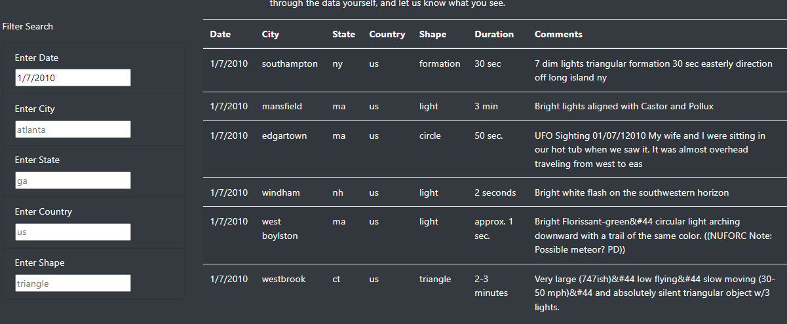

# UFOs

## Project Overview
A data journalist created a webpage with a dynamic table to organize UFO data with the ability to filter data based on date.  The data is currently in a JavaScript file.  However, the data journalist would like to provide a more in-depth analysis of UFO sightings.

## Purpose
The purpose of the project is to allow users to filter for multiple criteria in addtion to the date.  It is necessary to include filters for city, state, country, and shape as well.  Multiple criteria should be able to be filtered at the same time.

## Resources
 - Data Source: [UFO data](js/data.js)
 - Software: HTML/CSS, JavaScript, Visual Studio Code 1.62.3, Bootstrap 4.0.0

## Results
The user is able to type in the suggested placeholders within the filter input box.  It is imperative with the current design that the input criteria match exactly with the data in the JavaScript file.

### Search Examples
To perform a search by date, enter the desired date in required format, m/d/yyyy, and hit tab.

To perform a search by city, enter the desired city in lower case and hit tab.

To perform a search by state, enter the 2 character state abbreviation in lower case and hit tab.

To perform a search by country, enter the 2 character country code in lower case and hit tab.

To perform a search by shape, input the shape name in lower case and hit tab.

To perform a multi criteria search, just input any combination of the above fields, hitting tab after the last field.

The user can also click on the UFO sightings text in the top navigation bar at any time to re-initialize the page.

## Summary
 - One major drawback of the page design is that the user must know the exact criteria to search for.  For example, it is not intuitive for a user to select "light" as a shape.  In addition, the user can spend a lot of time inputting random dates until something appears or a city contained in the data.

 - Recommendations for future development would include:
    - Implementing dynamic dropdown lists of filter values to replace the necessity of the user typing the criteria exactly as it is found in the data.
    - For the date filter, consider a calendar pop up that highlights selectable dates that have data attached to them.
    - A more intuitive way to clear all the fields to get back to the beginning such as a Clear Filters button at the end of the form.  It may not be clear to users to click the top navigation bar to re-initialize the page.